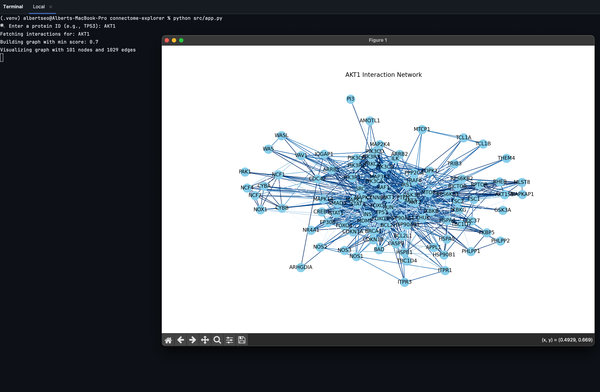

# Connectome Explorer

This is a Python-based tool used for fetching, analyzing, and visualizing protein-protein interaction networks
using data from the STRING database. 

The goal of this tool is to help explore biological connectivity in Homo sapiens through an interactive graph representation.

## Features
<li>Uses the STRING API to fetch any human protein data</li>
<li>Creates a network graph of protein-protein interactions</li>
<li>Visualizes the graph</li>

### Project Structure
<pre>
connectome-explorer/
│
├── src/
│   ├── app.py               # Main entry point
│   ├── data_loader.py       # Fetches data from STRING API
│   ├── network_builder.py   # Builds NetworkX graph
│   ├── visualizer.py        # Visualizes the graph
│
├── test.py                  # Simple test script
├── requirements.txt         # Python dependencies
├── README.md                # Project documentation
└── .gitignore               # Files to ignore in version control
</pre>

## Getting Started
### Clone the Repository
>git clone https://github.com/yourusername/connectome-explorer.git
> 
>  
> cd connectome-explorer
### Install Dependencies
>pip install -r requirements.txt
### Run the App using Terminal
> python src/app.py

## EXAMPLE OF USE

